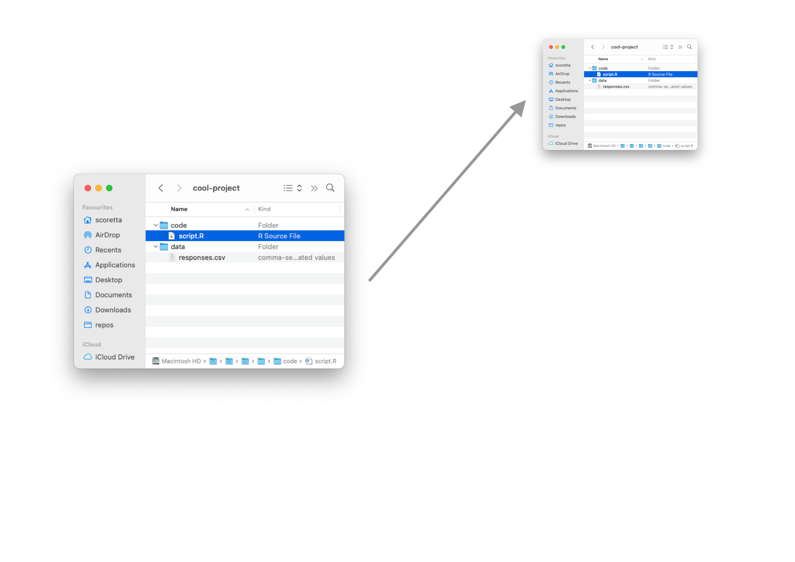

```{r setup, include=FALSE}
options(htmltools.dir.version = FALSE)
library(xaringanExtra)
```


# Why should I learn version control?

---


---


---


---


---

# Ok, I am convinced

---

# How does it work?

---

# Version 1


---

# Version 1 snapshot



---

# Version 2


---

# Version 2 snapshot


---

# Version 3


---

# Version 3 snapshot


---

# The versioning system `git`

- `git` is a very popular choice in **software development**.

--

- Tailored for tracking changes in software files.

--

- But, also useful with anything that is text-based (like analysis scripts, papers, dissertations, ...).

---

# What can `git` do for you?

- Keep track of new or deleted files in a project.

- Keep track of changes to individual files in a project.

  - Done on a line-by-line basis.

- Roll back to a previous version of the project or files.

- Make back-ups of your files.

---

# Let's try it!

---

# But what about data?

- `git` is not great with non-text data.

--

- Non-text data have no "lines" so `git` tracks changes to the entire file (rather than portions of it).

--

- This is very inefficient.

---

# Enter `dvc`

- `dvc` works on top of `git` to make data versioning easier and efficient.

--

- It has many features that can be used for many different purposes.

--

- You can use it as a back-up system as well!

---

# A complex project without `dvc`


---

# A complex project with `dvc`


---

# Let's try it!

---

# Summary
